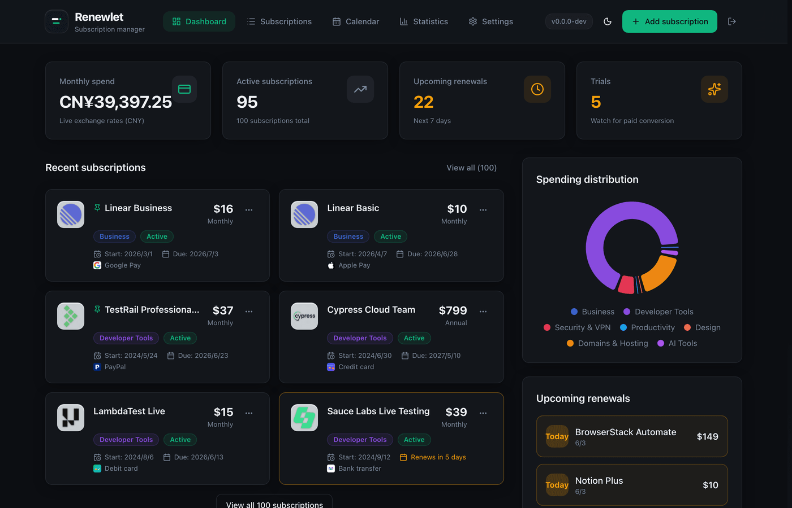
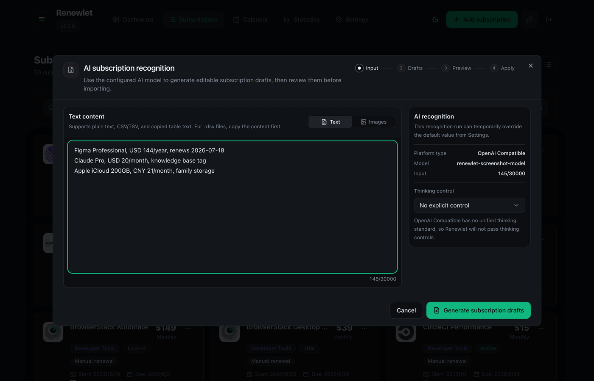
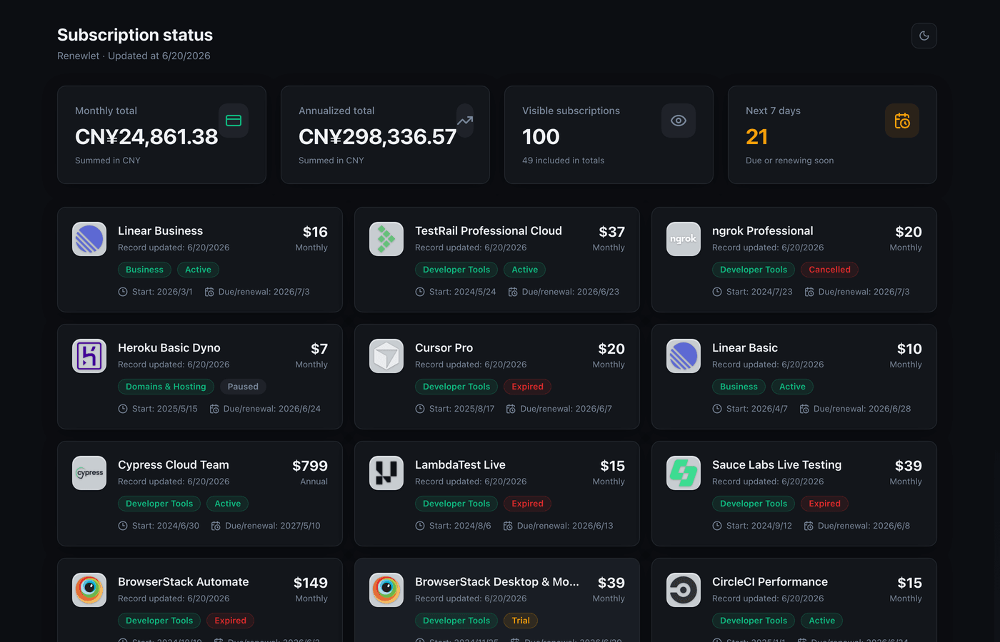
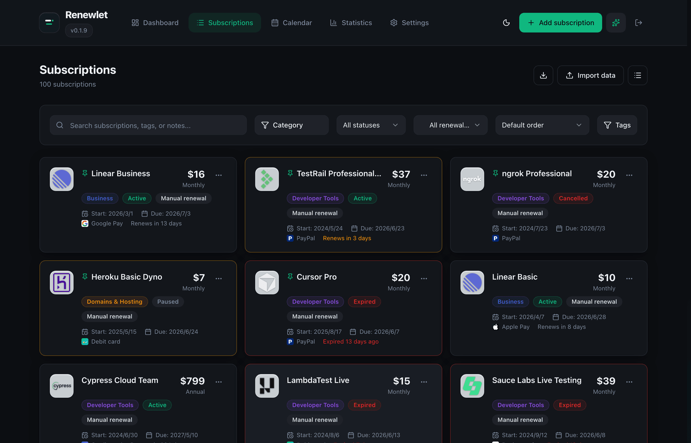
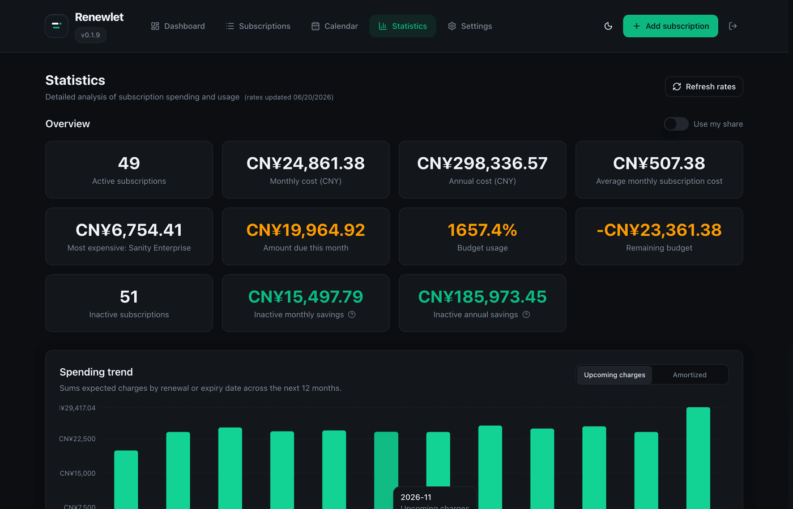
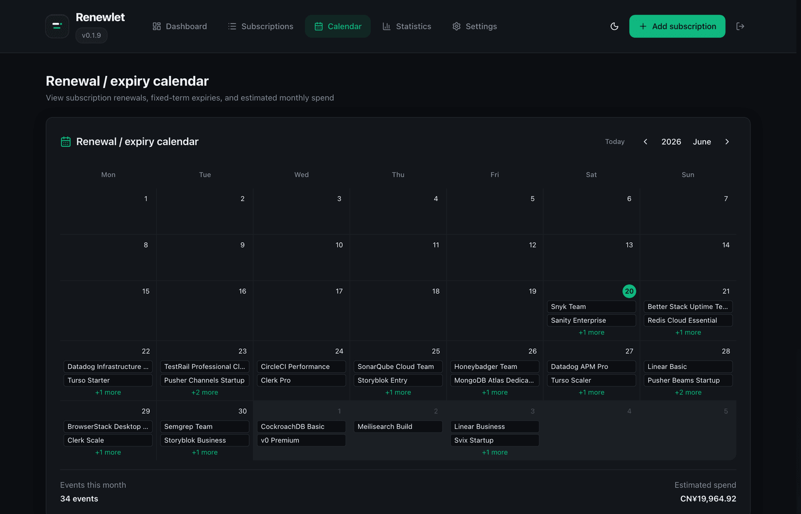
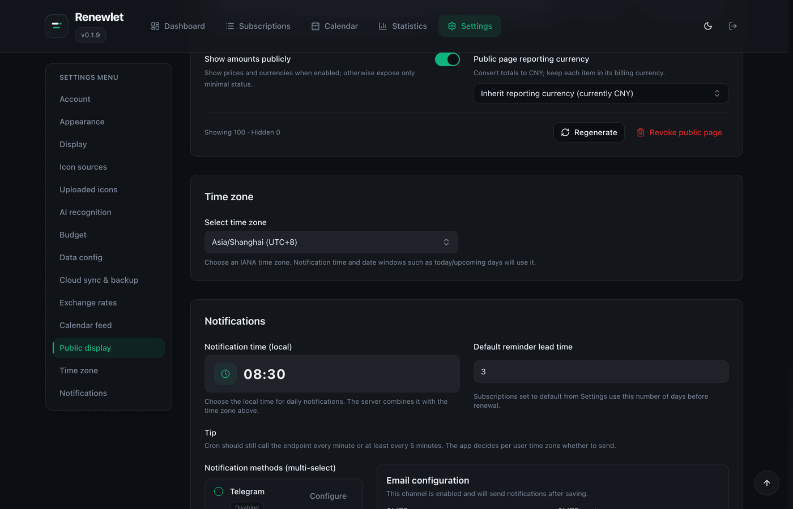
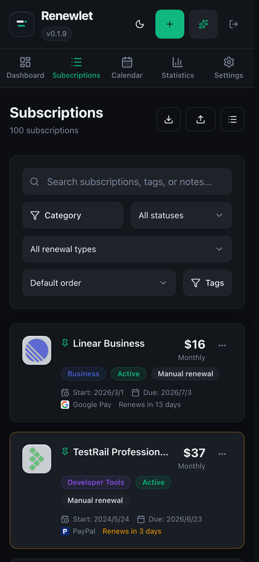
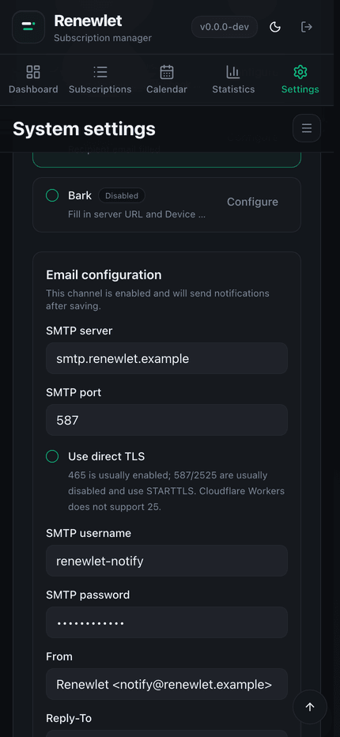

# Renewlet

<p align="center">
  
</p>

<p align="center">
  <a href="README.zh-CN.md">简体中文</a> · <a href="README.md">English</a>
</p>

<p align="center">
  
  
  
  
  
  
  
  
</p>

Renewlet is a self-hosted subscription ledger for tracking recurring charges and sending renewal reminders.

It records renewal dates, prices, currencies, categories, payment methods, logos, budgets, notes, and notification settings. It can run as a single Docker container, or on Cloudflare Workers with D1, R2, and Cron Triggers.

## Demo

Try the live demo: <https://renewlet-demo.olyq.org/>

Sign in with `demo@renewlet.local` / `renewlet-demo`. The demo resets regularly, so please do not put real personal data or credentials there.

<p align="center">
  
</p>

## Features

- Subscription records with billing cycles, statuses, tags, websites, notes, logos, categories, and payment methods.
- Reminder jobs based on each user's IANA time zone, local notification time, reminder days, repeat reminders, delivery history, and failed-send retries.
- Notifications through Telegram, Notifyx, Webhook, WeCom Bot, SMTP email, Bark, ServerChan, Discord, and PushPlus.
- Account security with authenticator codes, one-time recovery codes, and passkey sign-in.
- Monthly and yearly cost normalization, budget usage, category charts, payment-method charts, and inactive-subscription savings.
- AI recognition for bill screenshots, notes, CSV/TSV, and pasted table text; drafts are reviewed before import.
- Global private ICS feed and per-subscription calendar feeds.
- Public subscription status pages with per-subscription visibility and optional price display.
- Import and export Renewlet data, plus Wallos file imports.
- Uploaded logos, image URLs, built-in icon sources, and favicon fallback suggestions.
- Docker deployment with React, Go/PocketBase, SQLite, and static assets in one container.
- Cloudflare Workers deployment with React static assets, Worker API, D1, R2, and Cron Triggers.
- Mobile web views for subscriptions, filters, statistics, calendar, and settings.

## Docker Quick Start

Requirements: Docker and Docker Compose v2.

```bash
mkdir -p renewlet && cd renewlet
curl -fsSL https://raw.githubusercontent.com/zhiyingzzhou/renewlet/main/deploy/docker-deploy.sh | bash
docker compose up -d
```

Open:

```text
http://localhost:3000/setup
```

The deploy script creates `docker-compose.yml`, `.env`, and `data/`, then writes `PB_ENCRYPTION_KEY` and `CRON_SECRET`.

For production, pin a stable image tag:

```bash
sed -i.bak 's#RENEWLET_IMAGE=.*#RENEWLET_IMAGE="zhiyingzzhou/renewlet:0.2.5"#' .env
docker compose pull
docker compose up -d
```

If Docker Hub is unavailable, use GHCR:

```env
RENEWLET_IMAGE="ghcr.io/zhiyingzzhou/renewlet:0.2.5"
```

## Cloudflare Workers

<a href="https://deploy.workers.cloudflare.com/?url=https://github.com/zhiyingzzhou/renewlet"></a>

Use the deploy button for a Cloudflare-managed repository, or follow [Cloudflare Workers deploy](docs/cloudflare-workers-deploy.md) to manage D1, R2, GitHub Actions, and secrets yourself.

Do not click the deploy button again to upgrade. One-click deploy users run `Sync Renewlet Upstream` in the generated repository connected by Cloudflare Builds; manual deploy users update their fork to the latest Renewlet version, then run `Cloudflare Worker`. Cloudflare updates must apply D1 migrations before publishing the Worker.

## Upgrade

Back up data and config before upgrading:

```bash
tar -czf renewlet-backup-$(date +%F).tgz .env docker-compose.yml data
```

Upgrade with Docker Compose:

```bash
sed -i.bak 's#RENEWLET_IMAGE=.*#RENEWLET_IMAGE="zhiyingzzhou/renewlet:0.2.5"#' .env
docker compose pull
docker compose up -d
docker compose logs -f
```

Docker release images with the current binary layout can also update from the version badge at the top of Renewlet. Older images must run `docker compose pull && docker compose up -d` once before in-app updates become available.

## Common Commands

```bash
docker compose ps
docker compose logs -f
docker compose down
```

Common `.env` values:

| Variable | Purpose |
| --- | --- |
| `PORT` | Public port, `3000` by default. |
| `RENEWLET_IMAGE` | Docker image, `zhiyingzzhou/renewlet:latest` by default. |
| `TZ` | Container time zone for logs. Reminder times use each user's time zone. |
| `PB_ENCRYPTION_KEY` | Encryption key for sensitive PocketBase settings. Do not rotate it casually after deployment. |
| `CRON_SECRET` | Bearer secret for external Cron calls to `/api/cron/notifications`. |
| `RENEWLET_DEMO_MODE` | Docker Demo Mode switch, `false` by default. |
| `RENEWLET_CUSTOM_HEAD_SCRIPT` | Optional deployer-provided external `<script>` injection. Empty by default; leave unset to inject no external script. |
| `NOTIFICATION_SCHEDULER_ENABLED` | Built-in notification scheduler switch, `true` by default. |
| `HTTP_PROXY` / `HTTPS_PROXY` / `NO_PROXY` | Optional Docker/Go upstream HTTP proxy; lowercase variable names are also supported. |

The full Docker environment template is in `.env.example`.

### Docker Upstream Proxy

If your deployment needs a proxy for Telegram, AI providers, GitHub Release checks, built-in icon indexes, WebDAV, or S3-compatible storage, set the standard proxy variables in `.env`:

```env
HTTP_PROXY="http://host.docker.internal:7890"
HTTPS_PROXY="http://host.docker.internal:7890"
NO_PROXY="localhost,127.0.0.1,.local"
```

These variables affect Docker/Go server-side HTTP(S) upstream requests only. They do not affect SMTP, browser-loaded images, or Cloudflare Worker deployments. Inside the container, `127.0.0.1` / `localhost` points to the container itself; if the proxy runs on the host, use an address reachable from the container and recreate the container after changing `.env`:

```bash
docker compose up -d --force-recreate
```

Go also supports the lowercase variable names `http_proxy`, `https_proxy`, and `no_proxy`.

### Custom Head Script

Renewlet does not inject external scripts by default. When `RENEWLET_CUSTOM_HEAD_SCRIPT` is set, Renewlet injects exactly one deployer-provided external `<script>` tag into the SPA `<head>`:

```env
RENEWLET_CUSTOM_HEAD_SCRIPT='<script defer src="https://cdn.example.com/widget.js" data-host-url="https://api.example.com/widget"></script>'
```

Renewlet accepts only a single external script tag with `src` and no inline content. The script origin is automatically added to `script-src` and `connect-src`; when `data-host-url` is present, its origin is also added to `connect-src`.

Docker/Go deployments inject this at runtime, so changing the environment variable only requires restarting Renewlet. Cloudflare Static Assets reads the variable at build time, so changes require rebuilding and redeploying.

## Screenshots

<table>
  <tr>
    <td width="50%">
      <strong>AI recognition</strong><br>
      
    </td>
    <td width="50%">
      <strong>Public subscription status page</strong><br>
      
    </td>
  </tr>
  <tr>
    <td width="50%">
      <strong>Subscriptions</strong><br>
      
    </td>
    <td width="50%">
      <strong>Statistics</strong><br>
      
    </td>
  </tr>
  <tr>
    <td width="50%">
      <strong>Renewal calendar</strong><br>
      
    </td>
    <td width="50%">
      <strong>Notifications</strong><br>
      
    </td>
  </tr>
</table>

### Mobile

<table>
  <tr>
    <td width="50%">
      <strong>Mobile subscriptions</strong><br>
      
    </td>
    <td width="50%">
      <strong>Mobile notification methods</strong><br>
      
    </td>
  </tr>
</table>

## Contributing

Issues, documentation fixes, tests, and pull requests are welcome. For larger changes, open an issue first with the goal, use case, and rough approach.

## License

Renewlet is open-sourced under the [MIT License](LICENSE).
