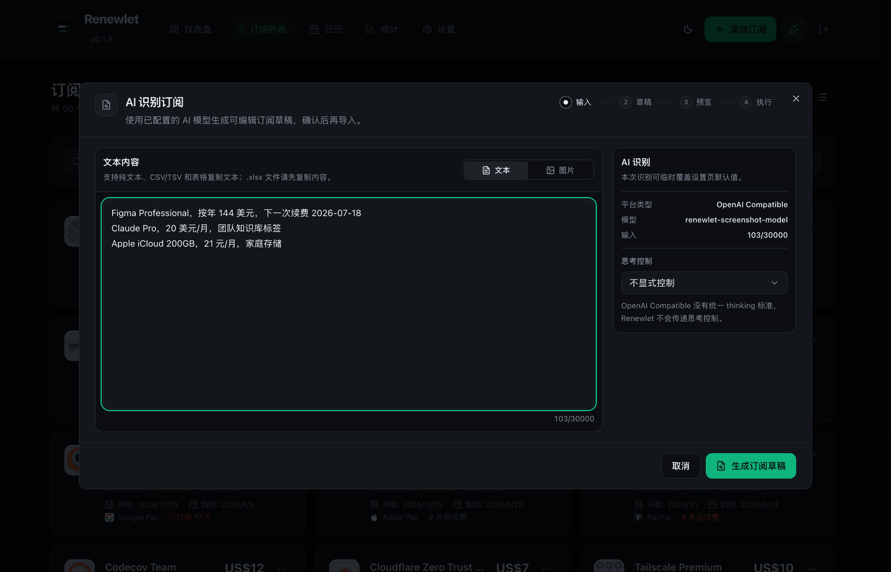
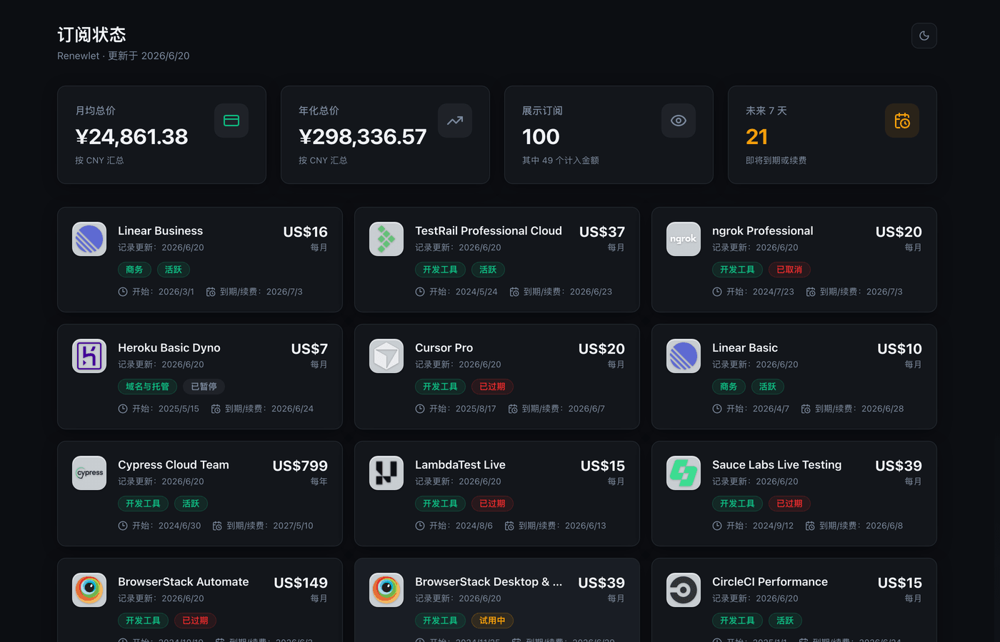
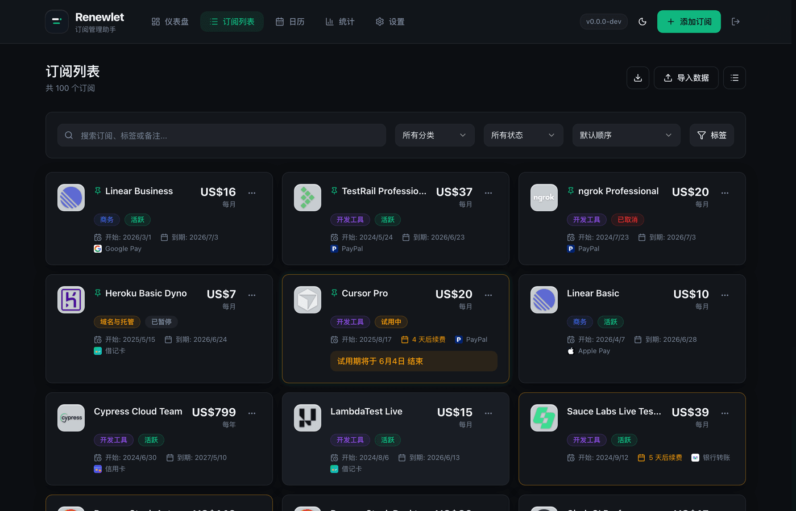
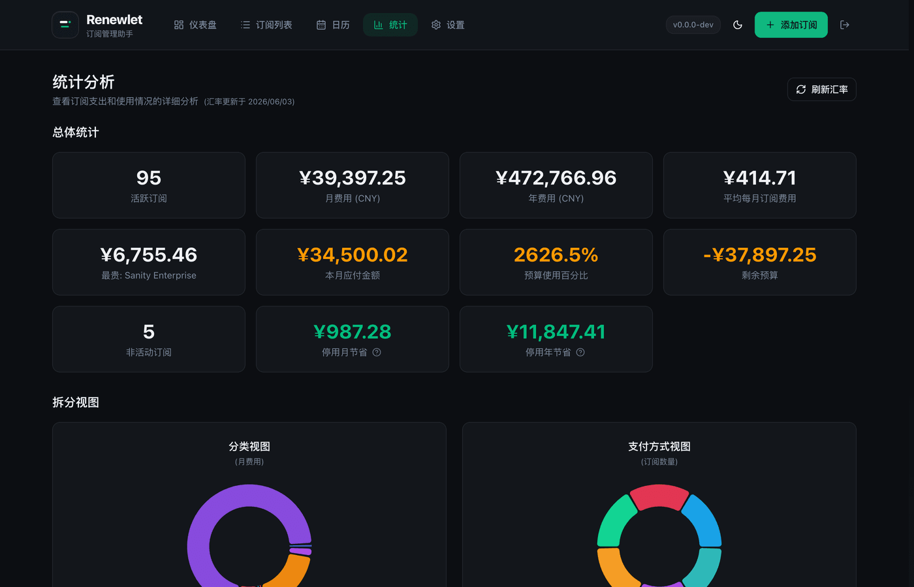
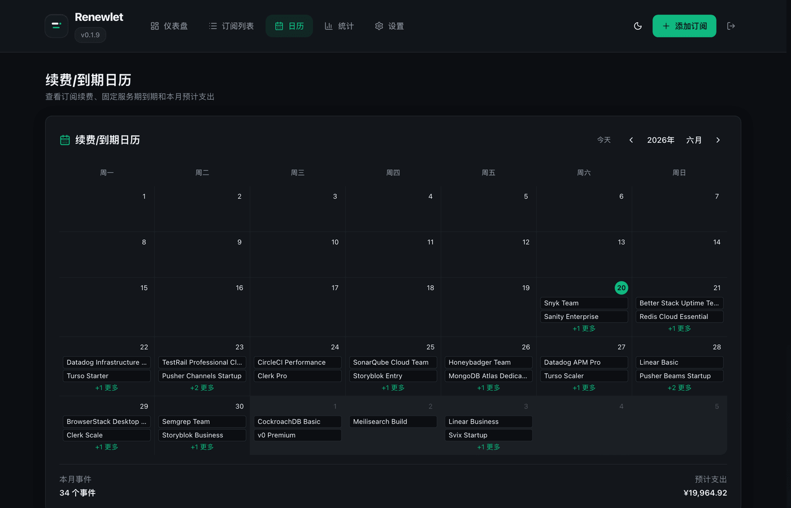
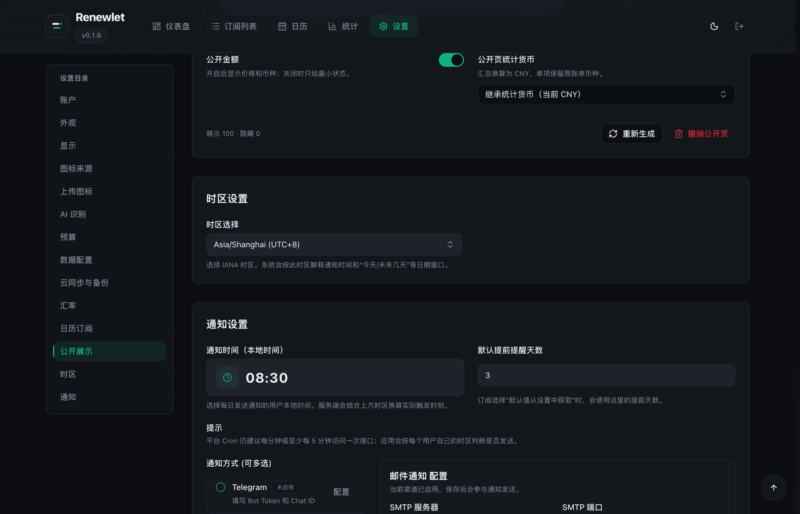
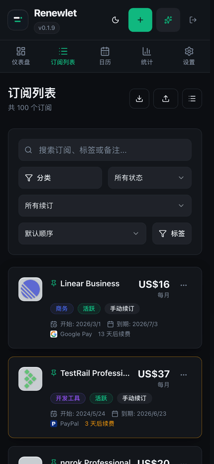
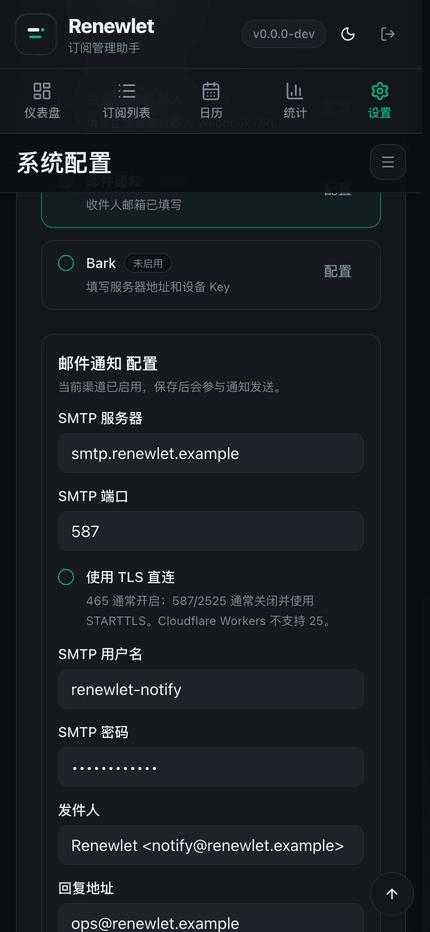

# Renewlet

<p align="center">
  
</p>

<p align="center">
  <a href="README.zh-CN.md">简体中文</a> · <a href="README.md">English</a>
</p>

<p align="center">
  
  
  
  
  
  
  
  
</p>

Renewlet 是一个自托管订阅账本，用来记录周期扣费并发送续费提醒。

它可以记录续费日期、价格、币种、分类、付款方式、Logo、预算、备注和通知设置。部署方式支持单 Docker 容器，也支持 Cloudflare Workers + D1 + R2 + Cron Triggers。

## 在线演示

先试一下：<https://renewlet-demo.olyq.org/>

使用 `demo@renewlet.local` / `renewlet-demo` 登录。演示站会定期重置，请不要放真实个人信息或真实凭据。

<p align="center">
  
</p>

## 功能

- 订阅记录：扣费周期、状态、标签、网站、备注、Logo、分类和付款方式。
- 续费提醒：按用户 IANA 时区、本地提醒时间、提前天数、重复提醒、发送历史和失败重试生成任务。
- 通知渠道：Telegram、Notifyx、Webhook、企业微信机器人、SMTP 邮件、Bark、Server酱、Discord 和 PushPlus。
- 账户安全：身份验证器验证码、一次性恢复码和通行密钥登录。
- 支出统计：月/年成本折算、预算使用、分类图表、付款方式图表和停用订阅节省。
- AI 识别：从账单截图、备忘录、CSV/TSV 或表格文本生成订阅草稿，确认后再导入。
- 日历订阅：全局私有 ICS Feed 和单个订阅 Feed。
- 公开订阅状态页：按订阅控制是否公开，并可选择是否展示金额。
- 数据迁移：导入导出 Renewlet 数据，并支持 Wallos 文件迁入。
- Logo 来源：上传 Logo、图片链接、内置图标来源和 favicon 候选。
- Docker 部署：React、Go/PocketBase、SQLite 和静态资源运行在同一个容器中。
- Cloudflare Workers 部署：React 静态资源、Worker API、D1、R2 和 Cron Triggers。
- H5 页面：订阅、筛选、统计、日历和设置均可在手机浏览器使用。

## Docker 快速开始

需要 Docker 和 Docker Compose v2。

```bash
mkdir -p renewlet && cd renewlet
curl -fsSL https://raw.githubusercontent.com/zhiyingzzhou/renewlet/main/deploy/docker-deploy.sh | bash
docker compose up -d
```

打开：

```text
http://localhost:3000/setup
```

部署脚本会生成 `docker-compose.yml`、`.env` 和 `data/`，并写入 `PB_ENCRYPTION_KEY` 与 `CRON_SECRET`。

生产环境固定到稳定版本：

```bash
sed -i.bak 's#RENEWLET_IMAGE=.*#RENEWLET_IMAGE="zhiyingzzhou/renewlet:0.2.5"#' .env
docker compose pull
docker compose up -d
```

如果 Docker Hub 拉取不可用，改用 GHCR：

```env
RENEWLET_IMAGE="ghcr.io/zhiyingzzhou/renewlet:0.2.5"
```

## Cloudflare Workers

<a href="https://deploy.workers.cloudflare.com/?url=https://github.com/zhiyingzzhou/renewlet"></a>

可以使用部署按钮创建 Cloudflare 管理的仓库；也可以按 [Cloudflare Workers 部署](docs/cloudflare-workers-deploy.zh-CN.md) 自己管理 D1、R2、GitHub Actions 和 secrets。

升级时不要重新点击部署按钮。一键部署用户在 Cloudflare Builds 连接的生成仓库里运行 `Sync Renewlet Upstream`；手动部署用户把自己的 fork 更新到 Renewlet 最新版本后运行 `Cloudflare Worker`。Cloudflare 升级必须先执行 D1 migrations，再发布 Worker。

## 升级

升级前备份数据和配置：

```bash
tar -czf renewlet-backup-$(date +%F).tgz .env docker-compose.yml data
```

使用 Docker Compose 升级：

```bash
sed -i.bak 's#RENEWLET_IMAGE=.*#RENEWLET_IMAGE="zhiyingzzhou/renewlet:0.2.5"#' .env
docker compose pull
docker compose up -d
docker compose logs -f
```

当前二进制布局的 Docker release 镜像也可以从页面顶部版本号进入系统更新。旧布局镜像需要先执行一次 `docker compose pull && docker compose up -d`，之后才会开放页面内更新。

## 常用命令

```bash
docker compose ps
docker compose logs -f
docker compose down
```

常用 `.env` 配置：

| 变量 | 用途 |
| --- | --- |
| `PORT` | 对外端口，默认 `3000`。 |
| `RENEWLET_IMAGE` | Docker 镜像，默认 `zhiyingzzhou/renewlet:latest`。 |
| `TZ` | 容器日志时区。提醒时间按用户设置的时区计算。 |
| `PB_ENCRYPTION_KEY` | PocketBase 敏感设置加密密钥，部署后不要随意更换。 |
| `CRON_SECRET` | 外部 Cron 调用 `/api/cron/notifications` 时使用的 Bearer 密钥。 |
| `RENEWLET_DEMO_MODE` | Docker Demo Mode 开关，默认 `false`。 |
| `RENEWLET_CUSTOM_HEAD_SCRIPT` | 可选部署者自备外链 `<script>` 注入。默认留空；留空时不注入任何外部脚本。 |
| `NOTIFICATION_SCHEDULER_ENABLED` | 内置通知调度器开关，默认 `true`。 |
| `HTTP_PROXY` / `HTTPS_PROXY` / `NO_PROXY` | 可选 Docker/Go 上游 HTTP 代理；也支持小写变量名。 |

完整 Docker 环境变量模板见 `.env.example`。

### Docker 上游代理

如果部署环境访问 Telegram、AI provider、GitHub Release、内置图标索引、WebDAV 或 S3 兼容存储需要代理，可以在 `.env` 中配置标准代理变量：

```env
HTTP_PROXY="http://host.docker.internal:7890"
HTTPS_PROXY="http://host.docker.internal:7890"
NO_PROXY="localhost,127.0.0.1,.local"
```

代理变量只影响 Docker/Go 服务端主动发起的 HTTP(S) 上游请求，不影响 SMTP、浏览器直连图片或 Cloudflare Worker 部署。容器内的 `127.0.0.1` / `localhost` 指向容器自身；如果代理运行在宿主机，请填写容器可访问的宿主机地址，并重建容器让环境变量生效：

```bash
docker compose up -d --force-recreate
```

Go 同时支持小写变量名 `http_proxy`、`https_proxy` 和 `no_proxy`。

### 自定义 Head 脚本

Renewlet 默认不注入任何外部脚本。配置 `RENEWLET_CUSTOM_HEAD_SCRIPT` 后，Renewlet 会向 SPA `<head>` 注入一个部署者自备的外部 `<script>` 标签：

```env
RENEWLET_CUSTOM_HEAD_SCRIPT='<script defer src="https://cdn.example.com/widget.js" data-host-url="https://api.example.com/widget"></script>'
```

Renewlet 只接受单个带 `src`、无内联内容的外链 script。脚本 origin 会自动加入 `script-src` 和 `connect-src`；如果提供 `data-host-url`，该 origin 也会加入 `connect-src`。

Docker/Go 部署在运行时注入，修改环境变量后只需重启 Renewlet。Cloudflare Static Assets 在构建时读取该变量并注入，修改后需要重新构建和部署。

## 截图

<table>
  <tr>
    <td width="50%">
      <strong>AI 识别订阅</strong><br>
      
    </td>
    <td width="50%">
      <strong>公开订阅状态页</strong><br>
      
    </td>
  </tr>
  <tr>
    <td width="50%">
      <strong>订阅清单</strong><br>
      
    </td>
    <td width="50%">
      <strong>统计分析</strong><br>
      
    </td>
  </tr>
  <tr>
    <td width="50%">
      <strong>续费日历</strong><br>
      
    </td>
    <td width="50%">
      <strong>通知设置</strong><br>
      
    </td>
  </tr>
</table>

### H5 移动端

<table>
  <tr>
    <td width="50%">
      <strong>移动端订阅列表</strong><br>
      
    </td>
    <td width="50%">
      <strong>移动端通知方式</strong><br>
      
    </td>
  </tr>
</table>

## 贡献

欢迎提交 issue、文档修正、测试或 pull request。较大的变更请先开 issue，说明目标、使用场景和大致方案。

## 许可证

Renewlet 基于 [MIT License](LICENSE) 开源。
