# Cloudflare Workers Deploy

## Recommended: One-Click Deploy

<a href="https://deploy.workers.cloudflare.com/?url=https://github.com/zhiyingzzhou/renewlet"></a>

1. Click the button.
2. Sign in to Cloudflare or authorize access.
3. Finish the Cloudflare wizard.
4. Open:

```text
https://<worker-name>.<workers-dev-subdomain>.workers.dev/setup
```

Keep the generated deploy command as `pnpm deploy`. Renewlet's deploy script applies D1 migrations before publishing the Worker, so new tables are created before the updated API starts serving traffic.

### Failed To Get Repository Contents

If the Cloudflare page says `Failed to get repository contents`, the deploy wizard is usually hitting a temporary rate limit or network-egress issue while reading the public GitHub repository. This does not mean the Renewlet server or Worker code failed to deploy.

If you are using a proxy/VPN node, a corporate or school network, or another shared network egress, the current egress IP may also be temporarily rate-limited by GitHub or Cloudflare. Avoid repeated retries; try again later, switch to a more reliable proxy node or network egress; if it still fails, use the manual deploy flow below.

### Upgrade

One-click deploy creates and connects a repository in your GitHub account. To upgrade Renewlet later, update that generated repository. Do not click the one-click deploy button again; that can create a new Worker/D1/R2 instead of updating your existing instance.

Open the Renewlet Worker in the Cloudflare dashboard, go to `Settings` -> `Builds`, and find the generated repository connected by Cloudflare Builds. This generated repository is not a standard GitHub fork, so it will not have GitHub's native `Sync fork` button.

Open the generated repository, then:

1. Go to `Actions`.
2. Select `Sync Renewlet Upstream`.
3. Click `Run workflow`.
4. Wait for the workflow to finish.

This workflow runs only when you click it; it does not update on a schedule. It updates the generated repository to the latest Renewlet files while preserving the Worker name, D1 database ID/name, R2 bucket, and vars in `wrangler.jsonc`. After the workflow commits the update, Cloudflare Builds redeploys automatically.

If GitHub says Actions are disabled, open the generated repository's `Settings` -> `Actions` -> `General`, enable Actions, and allow `Read and write permissions` under `Workflow permissions`.

### Existing One-Click Deploy Users

Older GitHub generated repositories might not have `Sync Renewlet Upstream`. Do not click the one-click deploy button again; keep using the original Worker, D1, R2, and generated repository.

If you do not see this workflow in `Actions`, add this file once in the original generated repository:

```text
.github/workflows/sync-renewlet-upstream.yml
```

Copy the content from this workflow: [sync-renewlet-upstream.yml](https://raw.githubusercontent.com/zhiyingzzhou/renewlet/main/.github/workflows/sync-renewlet-upstream.yml).

After committing it, future upgrades use the same path as new users: `Actions` -> `Sync Renewlet Upstream` -> `Run workflow`.

If you prefer to create D1/R2, the Cloudflare API Token, and GitHub Secrets yourself, use the manual deploy flow below.

## Manual Deploy (GitHub Actions)

Manual deploy is for users who want to manage Cloudflare resources and GitHub Actions themselves. After preparing the 5 values below, run `Cloudflare Worker` in your fork to apply D1 migrations and deploy the Worker.

Workflow:

- Checks Cloudflare Worker and frontend types
- Builds the Cloudflare frontend
- If all 5 GitHub Secrets are configured, generates `wrangler.generated.jsonc` from Secrets
- If all 5 GitHub Secrets are configured, applies remote D1 migrations and deploys the Worker

If any required secret is missing, the workflow still runs the Cloudflare checks and build, then skips the remote D1 migration and Worker deployment with a GitHub Actions notice.

Add these 5 values to GitHub Secrets to enable remote deployment.

### 1. Fork The Repository

Fork the Renewlet repository to your own account or organization.

Repository name already exists: use the existing fork, or choose another repository name.

### 2. Create Cloudflare Resources

Create a D1 database and an R2 bucket in the Cloudflare dashboard.

D1:

1. In the Cloudflare dashboard, open `Storage & Databases` -> `D1 SQL Database`.
2. Click `Create Database`.

   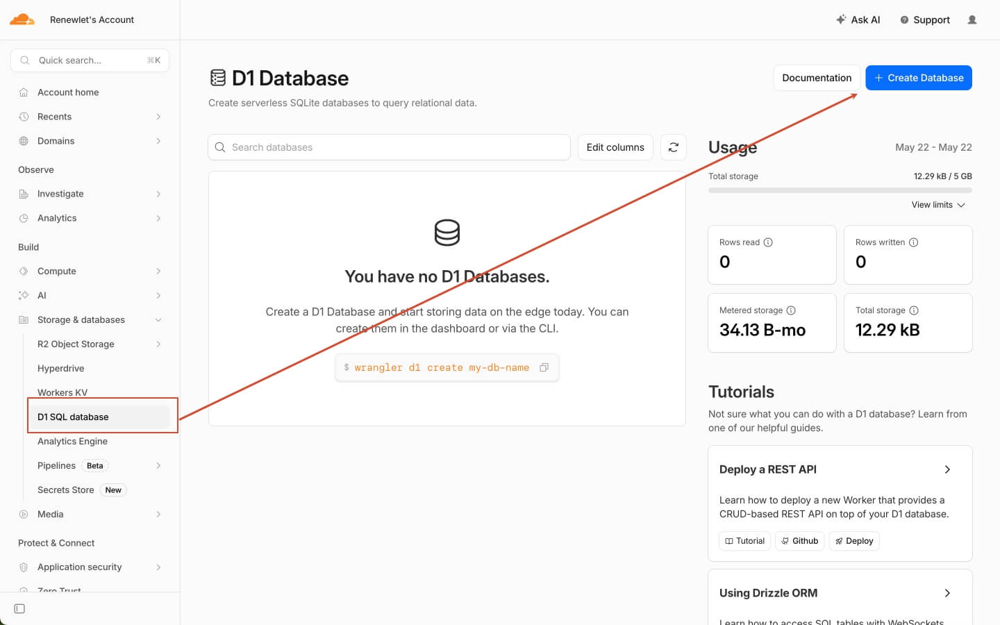

3. Enter `renewlet` as the database name.

   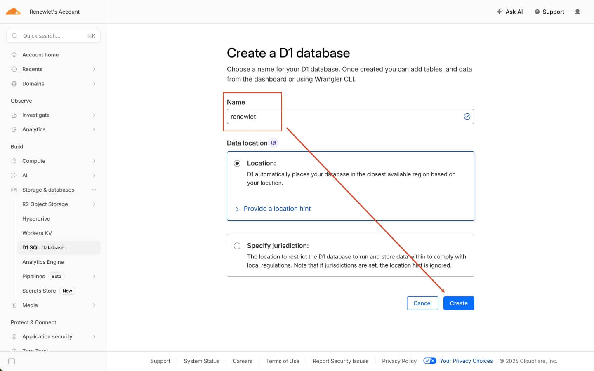

4. Open the created database and copy the database ID as `D1_DATABASE_ID`.

   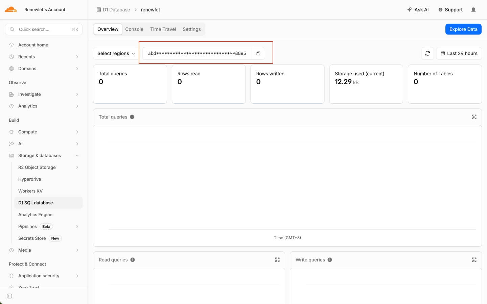

R2:

1. In the Cloudflare dashboard, open `Storage & Databases` -> `R2 Object Storage`.

   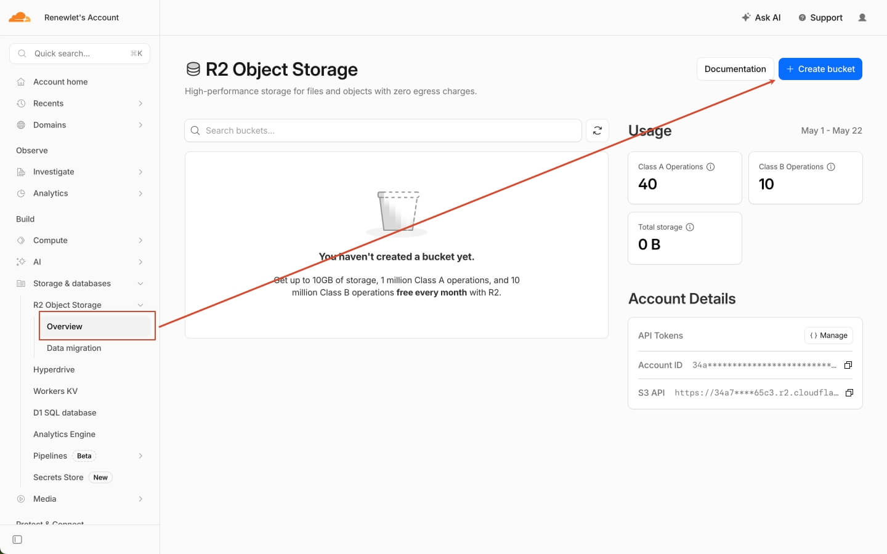

2. Create a bucket named `renewlet-assets`.

   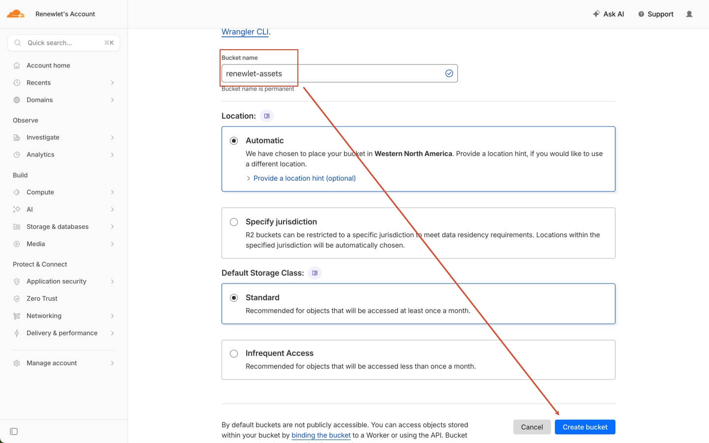

3. Copy the bucket name as `R2_BUCKET_NAME`.

   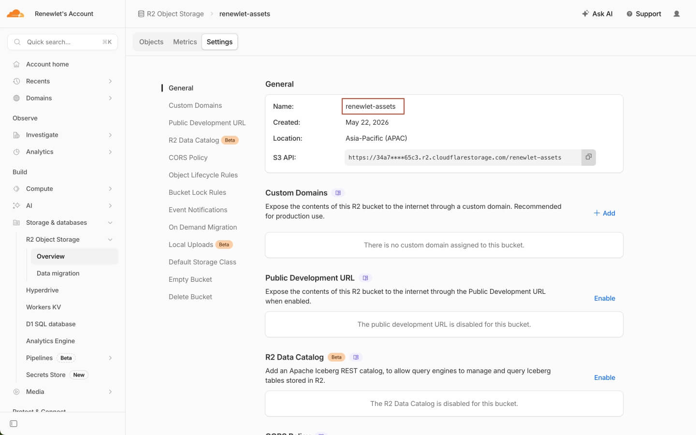

Renewlet's Worker binding names are fixed:

| Binding | Cloudflare product | Purpose |
| --- | --- | --- |
| `DB` | D1 | Users, sessions, subscriptions, settings, notification jobs |
| `ASSETS` | Workers Static Assets | React app and built-in icon seed indexes |
| `ASSETS_BUCKET` | R2 | Private uploaded logos/icons |

### 3. Get CLOUDFLARE_ACCOUNT_ID

Direct link: <a href="https://dash.cloudflare.com/?to=/:account/home" target="_blank" rel="noopener noreferrer">https://dash.cloudflare.com/?to=/:account/home</a>

1. Open the Cloudflare Dashboard.
2. Go to `Account home`.
3. Find the account used to deploy Renewlet.
4. Click the menu button on the right side of the account row.
5. Click `Copy account ID`.
6. Save the copied value as `CLOUDFLARE_ACCOUNT_ID`.

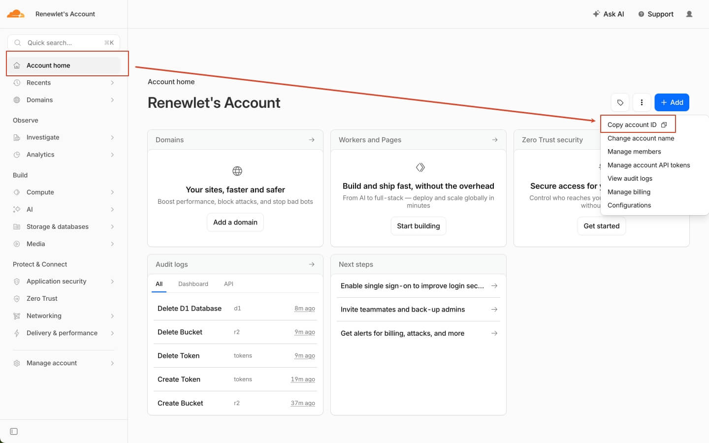

You can also copy it from the `Workers & Pages` page: open `Workers & Pages`, then click the copy button for `Account ID` in `Account details`.

Direct link: <a href="https://dash.cloudflare.com/?to=/:account/workers-and-pages" target="_blank" rel="noopener noreferrer">https://dash.cloudflare.com/?to=/:account/workers-and-pages</a>

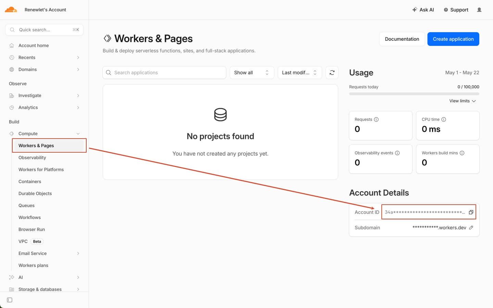

### 4. Create CLOUDFLARE_API_TOKEN

Direct link: <a href="https://dash.cloudflare.com/?to=/:account/api-tokens" target="_blank" rel="noopener noreferrer">https://dash.cloudflare.com/?to=/:account/api-tokens</a>

Permissions: `Edit Cloudflare Workers` + `Account` -> `D1` -> `Edit`. Scope resources to the account that deploys Renewlet; if you bind a custom domain, scope the zone to that domain.

1. Open the Cloudflare Dashboard.
2. Go to the `Account API tokens` page.
3. Click `Create Token`.

   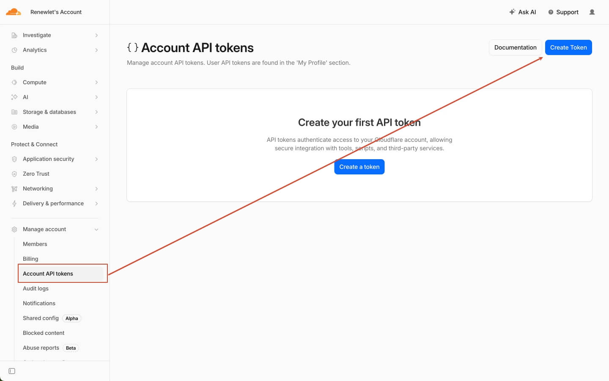

4. Set Token name to `renewlet-worker-deploy`.
5. Under `Permission policies`, open the `Custom` dropdown and select `Edit Cloudflare Workers`.

   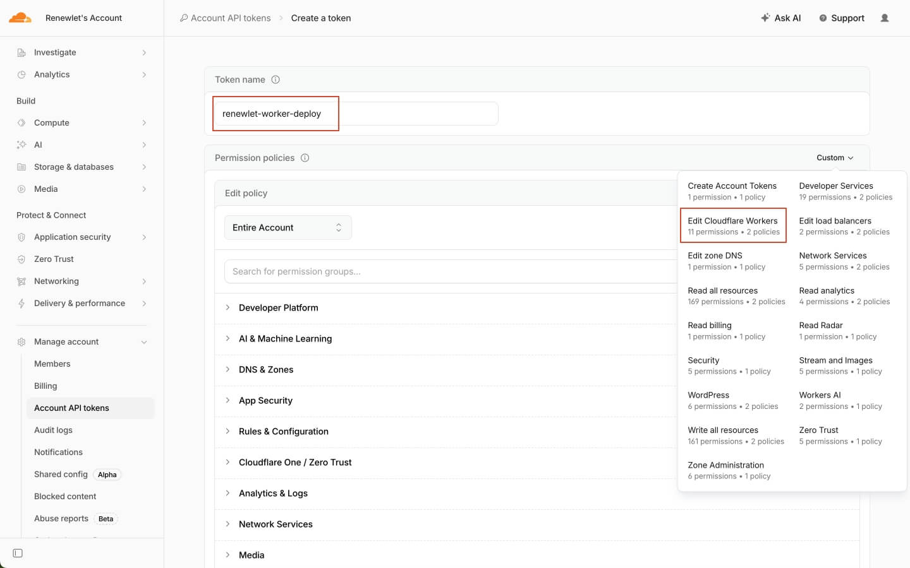

6. Add one permission row: `Account` -> `D1` -> `Edit`.

   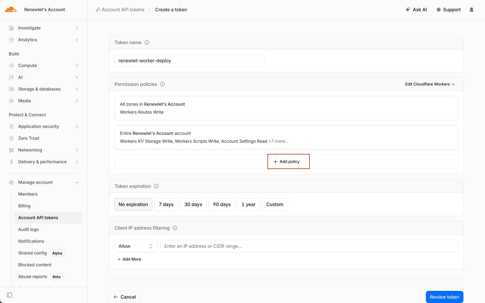

   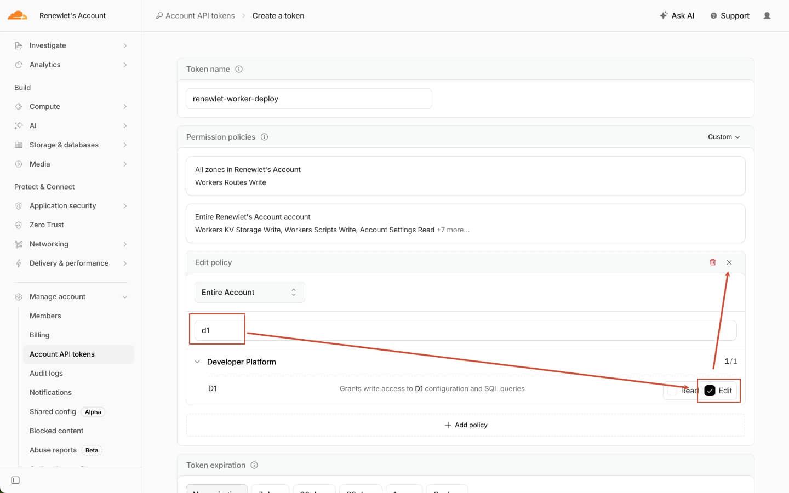

7. Scroll down to `Resources`.
8. If the page shows `Account Resources`: select `Include` -> the Cloudflare account used to deploy Renewlet.
9. If the page shows `Zone Resources`: select the domain that will later be bound to a Worker route or custom domain.
10. If the page does not show a resources section, click `Continue to summary`.

    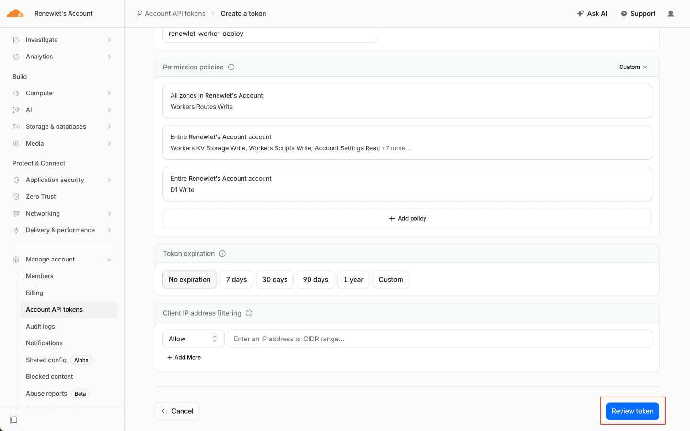

11. Review Token name, Permission policies, and Resources. Skip Resources if the page does not show them.
12. Click `Create Token`.

    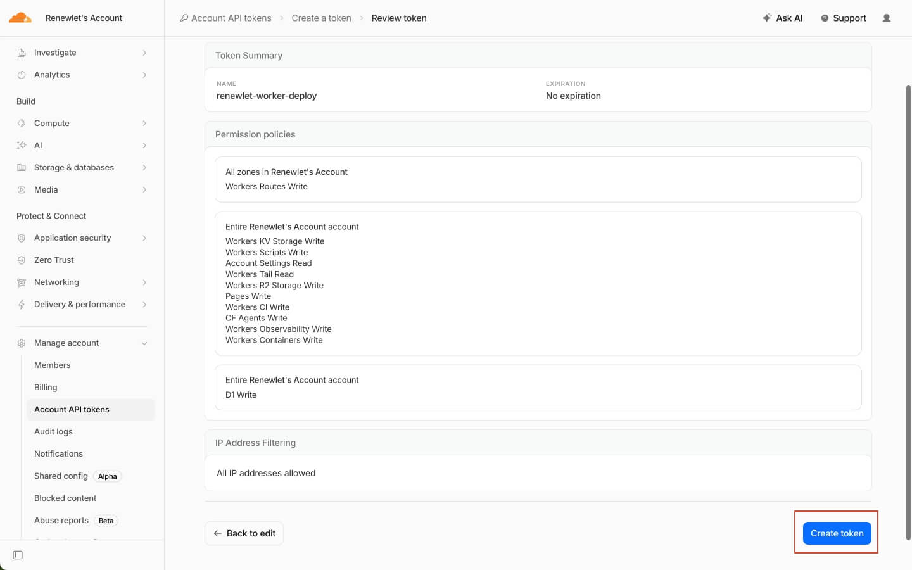

13. Copy the generated token and save it as `CLOUDFLARE_API_TOKEN`. **Save it immediately. The token is shown only once.**

    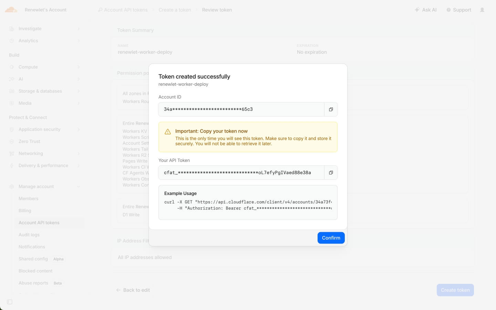

    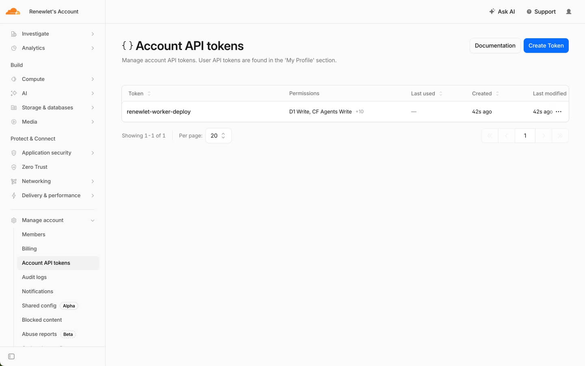

### 5. Configure GitHub Secrets

In your fork repository, open `Settings` -> `Secrets and variables` -> `Actions` -> `New repository secret`, then add these 5 required repository secrets:

| Secret | Value |
| --- | --- |
| `CLOUDFLARE_API_TOKEN` | Cloudflare API Token used by GitHub Actions to deploy the Worker and apply remote D1 migrations |
| `CLOUDFLARE_ACCOUNT_ID` | Cloudflare account ID used to deploy Renewlet |
| `WORKER_NAME` | Worker name, for example `renewlet` or `renewlet-prod` |
| `D1_DATABASE_ID` | D1 database ID copied from the Cloudflare dashboard |
| `R2_BUCKET_NAME` | R2 bucket name, for example `renewlet-assets` |


### 6. Run The Deployment

The workflow file is `.github/workflows/cloudflare-worker.yml`.

For the first deployment, run it manually from GitHub Actions. For later upgrades, update your fork to the latest Renewlet version first; if Actions are enabled, the update can redeploy automatically. You can also run it manually at any time:

The workflow needs the 5 required repository secrets above to deploy to Cloudflare. Without them, it only verifies the Cloudflare build path and does not change any remote D1 database or Worker.

1. Open your fork repository.
2. Go to `Actions`.
3. Select `Cloudflare Worker`.
4. Click `Run workflow`.


### 7. Open Renewlet

The default URL is:

```text
https://<WORKER_NAME>.<workers-dev-subdomain>.workers.dev/setup
```


Custom domain: after deployment, bind a Worker route or custom domain for the Worker in the Cloudflare dashboard.


## Update Version

One-click deploy users: follow the Upgrade steps above and run `Sync Renewlet Upstream` in the generated repository connected by Cloudflare Builds.

Manual deploy users: update your fork to the latest Renewlet version with `Sync fork` / `Update branch`. If deployment does not start automatically, open `Actions` and run `Cloudflare Worker`.

Every Cloudflare update must apply D1 migrations before publishing the Worker. `pnpm deploy` and GitHub Actions both keep this order.

## Optional: Wrangler CLI

Most deployments do not need Wrangler CLI. Use these commands only if you want to manage Cloudflare resources from your own machine.

Create resources:

```bash
pnpm install --frozen-lockfile
pnpm exec wrangler login
pnpm exec wrangler d1 create renewlet
pnpm exec wrangler r2 bucket create renewlet-assets
```

Export the real values and deploy:

```bash
export CLOUDFLARE_API_TOKEN="..."
export CLOUDFLARE_ACCOUNT_ID="..."
export WORKER_NAME="renewlet"
export D1_DATABASE_ID="..."
export R2_BUCKET_NAME="renewlet-assets"

pnpm cloudflare:config:ci
pnpm check:cloudflare
pnpm build:cloudflare
pnpm exec wrangler d1 migrations apply DB --remote --config wrangler.generated.jsonc
pnpm exec wrangler deploy --config wrangler.generated.jsonc
```

## Other Configuration

| Name | Type | Purpose |
| --- | --- | --- |
| `SETUP_ENABLED` | Worker var | `/setup` switch, defaults to `true` |
| `SESSION_TTL_DAYS` | Worker var | Login validity period, defaults to 30 days |
| `VITE_RENEWLET_RUNTIME=cloudflare` | Build variable | Frontend uses the Worker API |

## Common Cases

**What if the Worker name already exists?**

Change `WORKER_NAME` in GitHub Secrets, then rerun the workflow.

**Calendar feed says `no such table: calendar_feeds`?**

This means the Worker was updated before the remote D1 migrations finished or ran. Re-run the `Cloudflare Worker` workflow, or run:

```bash
pnpm cloudflare:config:ci
pnpm exec wrangler d1 migrations apply DB --remote --config wrangler.generated.jsonc
```

**ServerChan test notifications return HTTP 429?**

This is a ServerChan rate-limit response, not a Renewlet notification payload error. The official ServerChan FAQ says `429` means the source IP exceeded the API call limit within 24 hours, and the fix is to stop calling the API and try again after 24 hours.

When Renewlet runs on Cloudflare Workers, the ServerChan request is sent by the Worker. ServerChan counts the source IP that reaches ServerChan from the Worker egress path. The usual cause is that this Cloudflare egress source IP has hit ServerChan's 24-hour limit.

Use these fixes:

- Stop repeated tests immediately, then try again after 24 hours.
- If notifications are urgent, switch to SMTP, Telegram, Bark, or Webhook first.
- Renewlet chooses the endpoint from the SendKey automatically: `sctp...` is sent to the [official ServerChan³ API endpoint](https://doc2.ft07.com/zh/serverchan3/server/api), `https://<uid>.push.ft07.com/send/<sendkey>.send`; `SCT...` is sent to ServerChan Turbo at `https://sctapi.ftqq.com/<sendkey>.send`. If you entered an `sctp...` SendKey, Renewlet is already using the ServerChan³ endpoint instead of [SCT forwarding](https://doc2.ft07.com/zh/serverchan3/compatibility/sct-forward). A continued 429 still means ServerChan has rate-limited the Cloudflare egress source IP for 24 hours.

**Old `pb_data`?**

Use a separate export/import flow.
